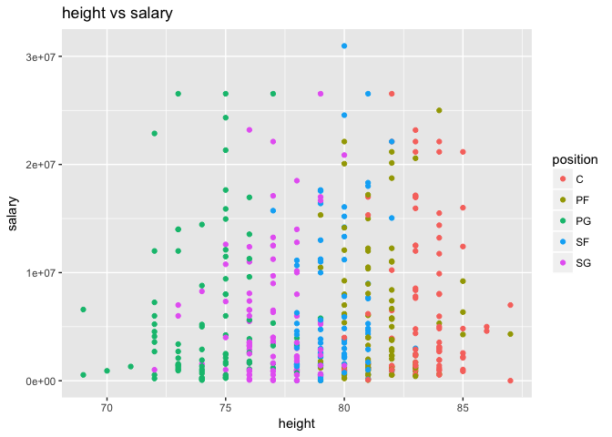
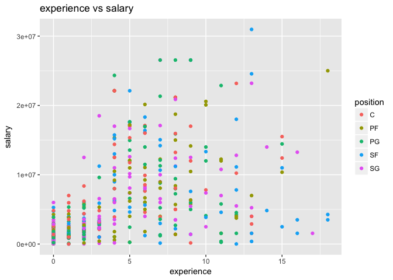
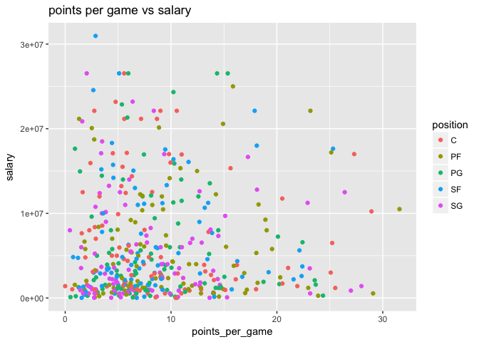
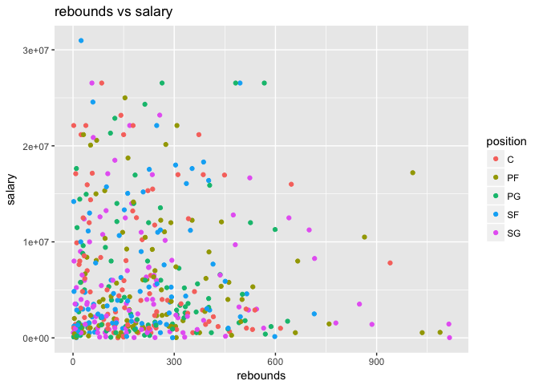

Post01-Meiying Huang
================
Meiying Huang
10/25/2017

Abstract
--------

#### This post involves analyzing data of top 5 professional sports in the U.S. in the 2016-2017 season. Data includes the revenue, average salary, highest salary. The purpose of this post is to study the different salary of 5 professional sports, and mainly identify the factors that are most likely to contribute to NBA player salaries. The objective of this post is to explain the salaries of the National Basketball Association(NBA) players. This post is to provide analytics for professional basketball teams and it inlcudes determining the factors resulting in high or low salaries to the player. In other words, it is to identify the performance variables i.e. scoring, assists, fouls, and other variables that significantly contributed to determine a NBA player's salary.

Keywords: Professional Sports, National Basketball Assiciation, Player Salaries, Player Performances
----------------------------------------------------------------------------------------------------

Introduction
------------

#### In the 2016-2017 National Basketball Association(NBA) season, LeBron James earned the highest salary $30.96 million. The average salary of an NBA player for the 2016-2017 season was $6.2 million which was higher than the average salary of a National Football League(NFL), National Hockey League(NHL),Major League Baseball(MLB), or Major League Soccer(MLS). What's more, 34.2% of NBA players have a salary higher than the NBA player average salary. Standard economic reasoning suggest that a NBA player's salary will be set to approximately equal his expected contribution to the team's revenues over the season and that is what we called "marginal revenue product." From a fan's perspective, a player's contributions mostly relate to the team's win-rate: can this athlete help win the team more games and eventually secure a championship title.

#### Getting the data: The data is gathered from different places: NBA.com States, Basketball Reference, github.

#### Cleaning: As it turns out, a lot of the columns of data needed to be removed.

#### Modeling: Most of the model used their stats as an input, and salary as output. Therefore, throughout this post, I frequently refer to the term of different cost driver, which is an independenrt variable that drivers or affect the dependent variable of salary. Basically, I gathered data and put salary on the y-axis by using different terms of x-axis variables. The different cost drivers I chose for testing are inlcuding total points scored, rebounds, assists, games player, height, point per game, and efficiency. The output is scaled from the min to max contract price for 2016-2017 deason.

#### Shortcomings: It is important to note that this only analyzes stats based on past year performance, which is very isolated. It doesn't take into account team strength, and potential(though many models take wins into account).

``` r
library(dplyr)
```

    ## 
    ## Attaching package: 'dplyr'

    ## The following objects are masked from 'package:stats':
    ## 
    ##     filter, lag

    ## The following objects are masked from 'package:base':
    ## 
    ##     intersect, setdiff, setequal, union

``` r
library(ggplot2)

dat2<-read.csv("~/stat133/stat133-hws-fall17/stat133/stat133-hws-fall17/hw03/data/nba2017-stats.csv")
write.csv(dat2,
          file="/Users/liminhuang/stat133-hws-fall17/post01/nba2017-ststa.csv",row.names=FALSE)

dat3<- read.csv("~/stat133/stat133-hws-fall17/stat133/stat133-hws-fall17/hw03/data/nba2017-roster.csv")
write.csv(dat3,
          file = "/Users/liminhuang/stat133-hws-fall17/post01/nba2017-roster.csv",row.names = FALSE)
```

``` r
##Top 5 professional sports leagues in U.S. by Revenue in 2016(by billion)
rev_nfl=13
rev_mlb=9.5
rev_nba=4.8
rev_nhl=3.7
rev_mls=0.6
value<-c(13,9.5,4.8,3.7,0.6)
sports<-c("NFL","MLB","NBA","NHL","MLS")
png(file="barchart_sports_revenue.png")

barplot(value,names.arg= sports, xlab= "Sports", ylab="revenue", col="orange",main="Top 5 professional sports leagues in U.S. by Revenue (in 2016 by billion)")
dev.off()
```

    ## quartz_off_screen 
    ##                 2

#### From the revenue barplot, NFL has the highest revenue in 2016 followed by MLB($9.5 billion), NBA($4.8 billion), NHL($3.7 billion), and MLS($0.6 billion). According to ESP, the major reason of NFL has a highest revenue is its sponsorship revenue. NFL received $1.25 billion(9.6% of its total revenue) in 2016 season. Another major money maker for the NFL is its $1 billion per season(four-year $4 billion partnership) with DirecTV.

``` r
##major U.S. sports leagues
##collecting the data from the reference
avg_nba=6.2
highest_nba=30.96  ##LeBron James

avg_mlb=4.4
highest_mlb=32  ##Clayton Kershaw

avg_nhl=2.9
highest_nhl=14  ##Anze Kopitar

avg_nfl=2.1
highest_nfl=31.25   ##Drew Brees

avg_mls=0.3
highest_mls=7.2 ##Kaka
##create the data for the bar chart
H<- c(6.2,4.4,2.9,2.1,0.3)
sports<-c("NBA","MLB","NHL","NFL","MLS")
png(file="barchart_sports_avg_salary.png")

barplot(H,names.arg= sports, xlab= "Sports", ylab="Avg_salary(million)", col="blue",main="Avg_salary of 5 most popular sports")
dev.off()
```

    ## quartz_off_screen 
    ##                 2

#### According to "The average player salary and highest-paid in NBA,MLB,NHL,NFL and MLS," the average salary of an NBA player for the 2016-2017 season is $6.2 million which is tops across all sports, followed by MLB($4.4 million), NHL($2.9 million), NFL($2.1 million), and MLS($0.3 million). Although NFL has a higher renenver than NBA, NFl's average salary is lower than NBA's average salary. One of the reasons is that NBA players get a slightly bigger slice of league revenue than do NFL players. NBA players get roungly half of all league revenue before expense. Secondly, the major reason is that NFL has a bigger rosters size than NBA. Even NFL players get twice as much money as NBA players, NFL has almost four times as many athletes as NBA. For example, there are 32 NFL teams with 53 rosters spots each, total has 1696 NFL players at any given moment. Meanwhile, NBA has 30n teams with 15 rosters spots each, making only around 450 NBA players.

``` r
##avg_salary and highest salary in 5 different sports
colors<- c("blue", "green")
sports<-c("NBA","MLB","NHL","NFL","MLS")
salary<-c("avg_salary","highest_salary")
##create the matrix of the values
values<- matrix(c(6.2,4.4,2.9,2.1,0.3,31,32,14,31.25,7.2),nrow = 2,ncol = 5, byrow = TRUE)

png(file="barchart_avg_salary_and_highest_salary.png")

barplot(values,main = "avg salary and highest salary in 5 different sports", names.arg= sports, xlab = "sports", ylab = "salary", col = colors)
legend("topright",salary, cex = 1,fill = colors)
dev.off()
```

    ## quartz_off_screen 
    ##                 2

#### The "avg salary and highest salary in 5 different sports" shows the average salary and highest salary break down among the major U.S. sports leagues based on the 2016 data.As we can see, MLB player Clayton Kershaw has the highest salary $32 million, followed by NFL player Drew Brees with $31.25 million,NBA players LeBron James with $31 million, NHL player Anze Kopitar with $14 million, and MLS player Kaka with $7.2 million.

``` r
##average salary group by player
salary_player<-dat3[, c('salary','player')]
salary_player
```

    ##       salary                   player
    ## 1     650000             A.J. Hammons
    ## 2    2700000             Aaron Brooks
    ## 3    4351320             Aaron Gordon
    ## 4    2022240            Adreian Payne
    ## 5   26540100               Al Horford
    ## 6   10230179             Al Jefferson
    ## 7    7680965          Al-Farouq Aminu
    ## 8    1315448            Alan Anderson
    ## 9     874636            Alan Williams
    ## 10  10154495               Alec Burks
    ## 11   5994764             Alex Abrines
    ## 12   4823621                 Alex Len
    ## 13     31969           Alex Poythress
    ## 14   4600000            Alexis Ajinca
    ## 15  18500000             Allen Crabbe
    ## 16  12000000             Amir Johnson
    ## 17  22116750           Andre Drummond
    ## 18  11131368           Andre Iguodala
    ## 19   2183072           Andre Roberson
    ## 20    945000          Andrew Harrison
    ## 21   6088993         Andrew Nicholson
    ## 22   6006600           Andrew Wiggins
    ## 23  22116750            Anthony Davis
    ## 24   3488000           Anthony Morrow
    ## 25   8000000         Anthony Tolliver
    ## 26    119494           Archie Goodwin
    ## 27   6500000              Aron Baynes
    ## 28  12500000            Arron Afflalo
    ## 29  11000000            Austin Rivers
    ## 30   8269663            Avery Bradley
    ## 31     20580             Axel Toupane
    ## 32   4008882             Ben McLemore
    ## 33   1551659               Beno Udrih
    ## 34  17000000          Bismack Biyombo
    ## 35  20140838            Blake Griffin
    ## 36   7000000         Boban Marjanovic
    ## 37    680534              Bobby Brown
    ## 38   1453680             Bobby Portis
    ## 39   3730653         Bojan Bogdanovic
    ## 40   7000000               Boris Diaw
    ## 41  22116750             Bradley Beal
    ## 42   5700000           Brandan Wright
    ## 43   1551659             Brandon Bass
    ## 44   5281680           Brandon Ingram
    ## 45   1200000         Brandon Jennings
    ## 46  12606250           Brandon Knight
    ## 47   3500000             Brandon Rush
    ## 48   1050961            Brian Roberts
    ## 49    102898            Briante Weber
    ## 50   1273920            Brice Johnson
    ## 51  21165675              Brook Lopez
    ## 52   1589640            Bruno Caboclo
    ## 53    543471              Bryn Forbes
    ## 54   3517200              Buddy Hield
    ## 55   3219579            C.J. McCollum
    ## 56   4583450               C.J. Miles
    ## 57   5000000              C.J. Watson
    ## 58   2112480            Cameron Payne
    ## 59   1562280             Caris LeVert
    ## 60  24559380          Carmelo Anthony
    ## 61  22116750         Chandler Parsons
    ## 62   7806971            Channing Frye
    ## 63    143860           Chasson Randle
    ## 64    543471            Cheick Diallo
    ## 65    543471           Chinanu Onuaku
    ## 66   1191480         Chris McCullough
    ## 67  22868828               Chris Paul
    ## 68    874636           Christian Wood
    ## 69   1296240             Clint Capela
    ## 70   5318313              Cody Zeller
    ## 71   7643979             Cole Aldrich
    ## 72   7600000             Corey Brewer
    ## 73   7330000              Cory Joseph
    ## 74  11242000             Courtney Lee
    ## 75    874636        Cristiano Felicio
    ## 76   7250000            D.J. Augustin
    ## 77   5332800         D'Angelo Russell
    ## 78     18255            Dahntay Jones
    ## 79   1171560             Damian Jones
    ## 80  24328425           Damian Lillard
    ## 81    980431             Damjan Rudez
    ## 82    543471            Daniel Ochefu
    ## 83  15050000         Danilo Gallinari
    ## 84  10000000              Danny Green
    ## 85   2978250         Dante Cunningham
    ## 86   3940320               Dante Exum
    ## 87   2318280              Dario Saric
    ## 88   8070175           Darrell Arthur
    ## 89   5229454          Darren Collison
    ## 90    874060          Darrun Hilliard
    ## 91   1551659                David Lee
    ## 92     73528              David Nwaba
    ## 93   1551659               David West
    ## 94    543471            Davis Bertans
    ## 95  21165675           DeAndre Jordan
    ## 96   1015696          DeAndre Liggins
    ## 97   1499760          DeAndre' Bembry
    ## 98   1180080          Dejounte Murray
    ## 99   1577280             Delon Wright
    ## 100 26540100            DeMar DeRozan
    ## 101 16957900         DeMarcus Cousins
    ## 102 14200000          DeMarre Carroll
    ## 103  1450000        Demetrius Jackson
    ## 104  2708582          Dennis Schroder
    ## 105  2092200         Denzel Valentine
    ## 106   259626           Deron Williams
    ## 107 11050000           Derrick Favors
    ## 108   543471            Derrick Jones
    ## 109 21323250             Derrick Rose
    ## 110   268029         Derrick Williams
    ## 111  2223600             Devin Booker
    ## 112  4228000             Devin Harris
    ## 113  2898000           Dewayne Dedmon
    ## 114  1369229            Deyonta Davis
    ## 115   543471            Diamond Stone
    ## 116  2898000             Dion Waiters
    ## 117 25000000            Dirk Nowitzki
    ## 118  2440200         Domantas Sabonis
    ## 119   576724       Donatas Motiejunas
    ## 120   543471      Dorian Finney-Smith
    ## 121  2483040           Doug McDermott
    ## 122  4276320            Dragan Bender
    ## 123 15330435           Draymond Green
    ## 124 23180275            Dwight Howard
    ## 125  8375000            Dwight Powell
    ## 126 23200000              Dwyane Wade
    ## 127  8081363            E'Twaun Moore
    ## 128  6666667                 Ed Davis
    ## 129     5145              Edy Tavares
    ## 130  2613600            Elfrid Payton
    ## 131    23069           Elijah Millsap
    ## 132  3241800          Emmanuel Mudiay
    ## 133 17145838              Enes Kanter
    ## 134 14000000             Eric Bledsoe
    ## 135 12385364              Eric Gordon
    ## 136  8400000           Ersan Ilyasova
    ## 137 17000000            Evan Fournier
    ## 138 16393443              Evan Turner
    ## 139  2730000           Frank Kaminsky
    ## 140   543471            Fred VanVleet
    ## 141  8000000           Garrett Temple
    ## 142  1655880              Gary Harris
    ## 143  8000000              George Hill
    ## 144   650000            Georges Niang
    ## 145  2202240     Georgios Papagiannis
    ## 146  1410598             Gerald Green
    ## 147  9000000         Gerald Henderson
    ## 148  2995421    Giannis Antetokounmpo
    ## 149 15890000             Goran Dragic
    ## 150 16073140           Gordon Hayward
    ## 151  2348783             Gorgui Dieng
    ## 152 17100000              Greg Monroe
    ## 153 22116750          Harrison Barnes
    ## 154 22116750         Hassan Whiteside
    ## 155  1704120           Henry Ellenson
    ## 156  1015696                Ian Clark
    ## 157 15944154              Ian Mahinmi
    ## 158  9700000            Iman Shumpert
    ## 159  1015696            Isaiah Canaan
    ## 160   255000            Isaiah Taylor
    ## 161  6587132            Isaiah Thomas
    ## 162  1074145         Isaiah Whitehead
    ## 163  6000000                Ish Smith
    ## 164  1034956              Ivica Zubac
    ## 165  4096950               J.J. Barea
    ## 166  7377500              J.J. Redick
    ## 167 12800000               J.R. Smith
    ## 168  5374320            Jabari Parker
    ## 169  6286408              Jae Crowder
    ## 170  4788840            Jahlil Okafor
    ## 171   600000              Jake Layman
    ## 172  2703960             Jakob Poeltl
    ## 173 13253012           Jamal Crawford
    ## 174  3210840             Jamal Murray
    ## 175  4540525            Jameer Nelson
    ## 176  2898000              James Ennis
    ## 177 26540100             James Harden
    ## 178  4000000            James Johnson
    ## 179  1551659              James Jones
    ## 180   980431     James Michael McAdoo
    ## 181  1825200              James Young
    ## 182   980431           JaMychal Green
    ## 183 10470000             Jared Dudley
    ## 184  1286160            Jarell Martin
    ## 185    63938            Jarrod Uthoff
    ## 186  5000000              Jason Smith
    ## 187  1551659              Jason Terry
    ## 188  1403611             JaVale McGee
    ## 189  4743000             Jaylen Brown
    ## 190 15000000               Jeff Green
    ## 191  8800000              Jeff Teague
    ## 192  1015696              Jeff Withey
    ## 193   980431             Jerami Grant
    ## 194  6511628              Jeremy Lamb
    ## 195 11483254               Jeremy Lin
    ## 196  1643040             Jerian Grant
    ## 197  9424084           Jerryd Bayless
    ## 198 17552209             Jimmy Butler
    ## 199 17000000              Joakim Noah
    ## 200  6540000              Jodie Meeks
    ## 201   980431               Joe Harris
    ## 202  2250000               Joe Ingles
    ## 203 11000000              Joe Johnson
    ## 204  1052342                Joe Young
    ## 205   165952             Joel Anthony
    ## 206   600000            Joel Bolomboy
    ## 207  4826160              Joel Embiid
    ## 208  1709720        Joffrey Lauvergne
    ## 209 12517606              John Henson
    ## 210 16957900                John Wall
    ## 211   161483          Johnny O'Bryant
    ## 212 10991957                Jon Leuer
    ## 213  5000000            Jonas Jerebko
    ## 214 14382022        Jonas Valanciunas
    ## 215   874636         Jonathon Simmons
    ## 216 12500000          Jordan Clarkson
    ## 217   173094          Jordan Crawford
    ## 218  3911380              Jordan Hill
    ## 219  1223653            Jordan Mickey
    ## 220   392478            Jose Calderon
    ## 221  1191480             Josh Huestis
    ## 222  5782450           Josh McRoberts
    ## 223   874636          Josh Richardson
    ## 224 11286518             Jrue Holiday
    ## 225  1987440         Juan Hernangomez
    ## 226  3267120            Julius Randle
    ## 227  1514160          Justin Anderson
    ## 228  3000000          Justin Hamilton
    ## 229  1015696           Justin Holiday
    ## 230  2593440          Justise Winslow
    ## 231  1921320             Jusuf Nurkic
    ## 232  3333333           K.J. McDaniels
    ## 233  5960160       Karl-Anthony Towns
    ## 234 17638063            Kawhi Leonard
    ## 235   543471               Kay Felder
    ## 236  3094014             Kelly Olynyk
    ## 237 12000000             Kemba Walker
    ## 238 12078652           Kenneth Faried
    ## 239 15730338            Kent Bazemore
    ## 240  3678319 Kentavious Caldwell-Pope
    ## 241 26540100             Kevin Durant
    ## 242 21165675               Kevin Love
    ## 243  1800000           Kevin Seraphin
    ## 244  1182840             Kevon Looney
    ## 245 15200000          Khris Middleton
    ## 246 16663575            Klay Thompson
    ## 247  8046500             Kosta Koufos
    ## 248  3872520                Kris Dunn
    ## 249  4000000           Kris Humphries
    ## 250  4317720       Kristaps Porzingis
    ## 251  1192080            Kyle Anderson
    ## 252  5239437              Kyle Korver
    ## 253 12000000               Kyle Lowry
    ## 254  3900000             Kyle O'Quinn
    ## 255  4837500             Kyle Singler
    ## 256   543471             Kyle Wiltjer
    ## 257 17638063             Kyrie Irving
    ## 258 20575005        LaMarcus Aldridge
    ## 259  4000000         Lance Stephenson
    ## 260  6191000             Lance Thomas
    ## 261  5200000        Langston Galloway
    ## 262  1207680          Larry Nance Jr.
    ## 263  4000000              Lavoy Allen
    ## 264  4000000          Leandro Barbosa
    ## 265 30963450             LeBron James
    ## 266  7000000             Lou Williams
    ## 267  2203000         Luc Mbah a Moute
    ## 268  1921320           Lucas Nogueira
    ## 269  1227000             Luke Babbitt
    ## 270 18000000                Luol Deng
    ## 271  1439880       Malachi Richardson
    ## 272   925000          Malcolm Brogdon
    ## 273  2500000          Malcolm Delaney
    ## 274  1627320            Malik Beasley
    ## 275 14000000            Manu Ginobili
    ## 276 21165675               Marc Gasol
    ## 277 12000000            Marcin Gortat
    ## 278  6333333          Marco Belinelli
    ## 279    31969      Marcus Georges-Hunt
    ## 280  4625000            Marcus Morris
    ## 281  3578880             Marcus Smart
    ## 282  3909840            Mario Hezonja
    ## 283  7400000          Markieff Morris
    ## 284  2941440          Marquese Chriss
    ## 285  1403611        Marreese Speights
    ## 286   543471         Marshall Plumlee
    ## 287 12250000          Marvin Williams
    ## 288  2328530            Mason Plumlee
    ## 289   383351              Matt Barnes
    ## 290  9607500      Matthew Dellavedova
    ## 291  8988764         Maurice Harkless
    ## 292   543471            Maurice Ndour
    ## 293  1551659        Metta World Peace
    ## 294  9213484           Meyers Leonard
    ## 295  1403611          Michael Beasley
    ## 296  3183526  Michael Carter-Williams
    ## 297   650000          Michael Gbinije
    ## 298 13000000   Michael Kidd-Gilchrist
    ## 299 26540100              Mike Conley
    ## 300  4837500            Mike Dunleavy
    ## 301  3500000              Mike Miller
    ## 302  1015696             Mike Muscala
    ## 303 12500000            Miles Plumlee
    ## 304  2898000     Mindaugas Kuzminskas
    ## 305 10500000          Mirza Teletovic
    ## 306 10770000              Monta Ellis
    ## 307  1000000         Montrezl Harrell
    ## 308  2463840             Myles Turner
    ## 309  3800000          Nemanja Bjelica
    ## 310  4384490             Nerlens Noel
    ## 311  3750000            Nick Collison
    ## 312  5443918               Nick Young
    ## 313 20869566            Nicolas Batum
    ## 314   543471         Nicolas Brussino
    ## 315  2993040             Nik Stauskas
    ## 316  1358500             Nikola Jokic
    ## 317  5782450           Nikola Mirotic
    ## 318 11750000           Nikola Vucevic
    ## 319  2751360              Noah Vonleh
    ## 320   874636            Norman Powell
    ## 321   247991              Norris Cole
    ## 322   210995              Okaro White
    ## 323  9904494                Omer Asik
    ## 324   138414              Omri Casspi
    ## 325  5893981              Otto Porter
    ## 326  5300000              P.J. Tucker
    ## 327  1196040            Pascal Siakam
    ## 328   874636          Pat Connaughton
    ## 329    31969          Patricio Garino
    ## 330  6000000         Patrick Beverley
    ## 331   543471            Patrick McCaw
    ## 332  6050000        Patrick Patterson
    ## 333  3578948              Patty Mills
    ## 334 15500000                Pau Gasol
    ## 335 18314532              Paul George
    ## 336 20072033             Paul Millsap
    ## 337  3500000              Paul Pierce
    ## 338   750000              Paul Zipser
    ## 339  1790902               Quincy Acy
    ## 340    63938               Quinn Cook
    ## 341 14000000              Rajon Rondo
    ## 342  1052342         Rakeem Christmas
    ## 343  6000000           Ramon Sessions
    ## 344  2500000               Randy Foye
    ## 345  1811040            Rashad Vaughn
    ## 346   937800                Raul Neto
    ## 347  1551659           Raymond Felton
    ## 348  2255644           Reggie Bullock
    ## 349 14956522           Reggie Jackson
    ## 350  2500000        Richard Jefferson
    ## 351  1025831           Richaun Holmes
    ## 352 13550000              Ricky Rubio
    ## 353  1015696         Robert Covington
    ## 354 13219250              Robin Lopez
    ## 355  1406520              Rodney Hood
    ## 356   543471          Rodney McGruder
    ## 357   543471                Ron Baker
    ## 358  1395600  Rondae Hollis-Jefferson
    ## 359   282595             Ronnie Price
    ## 360  5000000              Roy Hibbert
    ## 361 13333333                 Rudy Gay
    ## 362  2121288              Rudy Gobert
    ## 363 26540100        Russell Westbrook
    ## 364 18735364            Ryan Anderson
    ## 365   418228               Ryan Kelly
    ## 366   874636              Salah Mejri
    ## 367  1720560               Sam Dekker
    ## 368  1410598            Sasha Vujacic
    ## 369   980431          Sean Kilpatrick
    ## 370   543471           Semaj Christon
    ## 371 12250000              Serge Ibaka
    ## 372  8000000         Sergio Rodriguez
    ## 373  2898000               Seth Curry
    ## 374  3046299         Shabazz Muhammad
    ## 375  1350120           Shabazz Napier
    ## 376  5782450         Shaun Livingston
    ## 377    89513               Shawn Long
    ## 378   543471        Sheldon McClellan
    ## 379  2433334             Shelvin Mack
    ## 380  1188840          Skal Labissiere
    ## 381 11241218             Solomon Hill
    ## 382   726672        Spencer Dinwiddie
    ## 383  6348759            Spencer Hawes
    ## 384  2969880          Stanley Johnson
    ## 385 12112359            Stephen Curry
    ## 386   950000        Stephen Zimmerman
    ## 387  3140517             Steven Adams
    ## 388   874636           T.J. McConnell
    ## 389  2128920              T.J. Warren
    ## 390  8950000               Taj Gibson
    ## 391  6191000              Tarik Black
    ## 392 10000000            Terrence Ross
    ## 393  1906440             Terry Rozier
    ## 394  3850000          Thabo Sefolosha
    ## 395 14153652           Thaddeus Young
    ## 396  1050961          Thomas Robinson
    ## 397  2568600               Thon Maker
    ## 398  8550000           Tiago Splitter
    ## 399  2090000              Tim Frazier
    ## 400  2281605             Tim Hardaway
    ## 401   543471           Tim Quarterman
    ## 402 16000000           Timofey Mozgov
    ## 403  1326960  Timothe Luwawu-Cabarrot
    ## 404 17200000            Tobias Harris
    ## 405  2870813         Tomas Satoransky
    ## 406  5505618               Tony Allen
    ## 407 14445313              Tony Parker
    ## 408  2368327               Tony Snell
    ## 409   543471           Treveon Graham
    ## 410  7806971             Trevor Ariza
    ## 411  9250000            Trevor Booker
    ## 412  3386598               Trey Burke
    ## 413  2340600               Trey Lyles
    ## 414 15330435         Tristan Thompson
    ## 415  3332940             Troy Daniels
    ## 416   150000            Troy Williams
    ## 417  1315448                Ty Lawson
    ## 418  1733880              Tyler Ennis
    ## 419  5628000            Tyler Johnson
    ## 420   918369               Tyler Ulis
    ## 421  8000000             Tyler Zeller
    ## 422 10661286             Tyreke Evans
    ## 423 12415000           Tyson Chandler
    ## 424  1339680               Tyus Jones
    ## 425  4000000            Udonis Haslem
    ## 426  6552960           Victor Oladipo
    ## 427  4264057             Vince Carter
    ## 428  1793760             Wade Baldwin
    ## 429  6000000          Wayne Ellington
    ## 430    83119             Wayne Selden
    ## 431  5628000           Wesley Johnson
    ## 432 17100000          Wesley Matthews
    ## 433  3533333              Will Barton
    ## 434  3551160      Willie Cauley-Stein
    ## 435  1015696              Willie Reed
    ## 436  1375000        Willy Hernangomez
    ## 437 11200000          Wilson Chandler
    ## 438   207798             Yogi Ferrell
    ## 439  2240880              Zach LaVine
    ## 440 10361445            Zach Randolph
    ## 441  2898000            Zaza Pachulia

``` r
mean(dat3$salary)
```

    ## [1] 6187014

``` r
##The average salary of an NBA player for the 2016-2017 season was $6.19million. 
```

``` r
##Pie Chart with Percentages
##Creat data for the graph
nrow(dat3[dat3$player,])  
```

    ## [1] 441

``` r
mean(dat3$salary)
```

    ## [1] 6187014

``` r
dat1<-arrange(dat3,desc(salary))##441

salary1<-dat1[dat1$salary>=20000000,]
nrow(salary1)  ##28
```

    ## [1] 28

``` r
salary2<-dat1[dat1$salary<20000000 & 
            dat1$salary>=15000000,]
nrow(salary2) ##29
```

    ## [1] 29

``` r
salary3<-dat1[dat1$salary<15000000 & 
           dat1$salary>=10000000,]
nrow(salary3) ##49
```

    ## [1] 49

``` r
salary4<-dat1[dat1$salary<10000000 & 
           dat1$salary>=5000000,]
nrow(4)   ##75
```

    ## NULL

``` r
salary5<-dat1[dat1$salary<5000000 &
            dat1$salary>=1000000,]
nrow(salary5)   ##179
```

    ## [1] 179

``` r
salary6<-dat1[dat1$salary<1000000,]
nrow(salary6)   ##81
```

    ## [1] 81

``` r
x<- c(28,29,49,75,179,81)
labels<-c("salary1","salary2","salary3","salary4","salary5","salary6")
piepercent<-round(100*x/sum(x),1)

##give the chart file a name
png(file="pie chart of salary.png")

##plot the chart
pie(x,labels=piepercent,main="Pie Chart of Salary",
    col = rainbow(length(x)))
legend("topright",c("salary1","salary2",
        "salary3","salary4","salary5","salary6"),
       cex = 1, fill =rainbow(length(x)))

##save the file
dev.off()
```

    ## quartz_off_screen 
    ##                 2

#### Frist of all, as we saw in the results, the average salary of an NBA player for the 2016-2017 season was $6,187,014 (around $6.2 million.) (Around 40.6%) Most of the NBA players earned between $1 million and $5 million during 2016 to 2017 season. 81.6% of the NBA players earned more than $1 million in 2016-2017 season.

#### What's more, from the pie chart of salary, 28 (6.3%) of NBA players enrned higher than $20 million during the 2016-2017 deason.

``` r
above_avg_salary<- dat1[dat1$salary>=6187014,]
below_avg_salary<- dat1[dat1$salary<6187014,]
nrow(above_avg_salary) ##151
```

    ## [1] 151

``` r
nrow(below_avg_salary) ##290
```

    ## [1] 290

``` r
x<-c(151,290)
labels<-c("above_avg_salary", "below_avg_salary")
piepercent<-round(100*x/sum(x),1)
png(file = "pie chart of avg_salary.png")
pie(x,labels=piepercent,main="Pie Chart of avg_Salary",
    col = rainbow(length(x)))
legend("topright",c("above_avg_salary", "below_avg_salary"),
       cex = 1, fill =rainbow(length(x)))
dev.off()
```

    ## quartz_off_screen 
    ##                 2

``` r
head(salary,1)
```

    ## [1] "avg_salary"

#### From the pie chart of the avg\_salary, there was 65.8% of NBA players have a salary below the average salary and only 34.2% of NBA players have a salary higher than the average salary. However, in the 2016-2017, the highest salary was Cleveland Cavaliers's Lebron James who made $31 million.

``` r
##Performance of players
##scatterplot_1
mutate(dat3,dat)
```

    ## Error in mutate_impl(.data, dots): Binding not found: dat.

``` r
ggplot(data=dat3,aes(x=points, y=salary))+
  geom_point(aes(color= position), alpha=0.7)+
  ggtitle("points vs salary")
```

    ## Don't know how to automatically pick scale for object of type function. Defaulting to continuous.

    ## Error in (function (..., row.names = NULL, check.rows = FALSE, check.names = TRUE, : arguments imply differing number of rows: 441, 0


``` r
total_points=3*dat2$points3_made+2*dat2$points2_made+dat2$points1_made
dat3<-mutate(dat3,total_points)
ggplot(data = dat3, 
       aes(x = total_points, y = salary)) +
  geom_point(aes(color= position),alpha=0.7) +
  facet_wrap(~ position)+
  geom_smooth(method = loess)+
  ggtitle("points vs salary in different positions")
```


#### Here is a general plot of how different total points affect the salary in different positions. The relationship between the total points and salary is not very strong but we can see that the higher points player make, the higher salary they are tending to get.

``` r
data1<-data.frame(dat2)
missed_fg=dat2$field_goals_atts-dat2$field_goals_made
missed_ft=dat2$points1_atts-dat2$points1_made
total_points=3*dat2$points3_made+2*dat2$points2_made+dat2$points1_made
rebounds=dat2$off_rebounds+dat2$def_rebounds
assist=dat2$assists
steals=dat2$steals
blocks=dat2$blocks
turnovers=dat2$turnovers
fouls=dat2$fouls
efficiency=total_points+rebounds+assist+steals+blocks-missed_fg-
  missed_ft-turnovers
min_per_game=dat2$minutes/dat2$games_played
position=dat3$position
pts_per_game=total_points/dat2$games_played

data2<-mutate(dat3,missed_fg,missed_ft,total_points,rebounds,assist,steals,blocks,turnovers,fouls,efficiency,min_per_game,pts_per_game,salary, position)
```

``` r
c_avg_salary<- filter(data2,position=="C")
mean(c_avg_salary$salary) ##6987682
```

    ## [1] 6987682

``` r
pf_avg_salary<-filter(data2,position=="PF")
mean(pf_avg_salary$salary) ##5890363
```

    ## [1] 5890363

``` r
pg_avg_salary<- filter(data2,position=="PG")
mean(pg_avg_salary$salary) ##6069029
```

    ## [1] 6069029

``` r
sf_avg_salary<- filter(data2,position=="SF")
mean(sf_avg_salary$salary) ##6513374
```

    ## [1] 6513374

``` r
sg_avg_salary<- filter(data2,position=="SG")
mean(sg_avg_salary$salary) ##5535260
```

    ## [1] 5535260

``` r
value<-c(6987682,5890363,6069029,6513374,5535260)
positions<-c("C-position","PF-position","PG-position","SF-position","SG-position")
png(file="barchart_position_salary.png")

barplot(value,names.arg= positions, xlab= "position", ylab="avg_salary", col="orange",main="positions vs salary of NBA player")
dev.off()
```

    ## quartz_off_screen 
    ##                 2

#### Among 441 NBA player, C position players have a higher average salary of $7.0 million. And SG position players have a lowest average salary $5.5 million which is $1.5 millions lower than C position player.

#### It shows us that the salary does not has a strong relationship with positions. But C position players tend to have a higher average salary

``` r
height=dat3$height
ggplot(data=data2,aes(x=height, y=salary))+
  geom_point(aes(color= position))+
  ggtitle("height vs salary")
```



#### There appears to be a weak positive correlation between the players height vs salary.However, it shows us that C position players tend to have a higer height between 82 to 88, followed by PF position player (between 80 to 85), SF position player(between 78 to 82), SG position player(between 75 to 78), and PG position player(between 68 to 77).

``` r
experience=dat3$experience
ggplot(data=data2,aes(x=experience, y=salary))+
  geom_point(aes(color= position))+
  ggtitle("experience vs salary")
```



#### There appears to be a positive correlation between the players experience vs salary. Players with higher experience tend to have a higher salary.

``` r
efficiency= data2$efficiency
ggplot(data=data2,aes(x=efficiency, y=salary))+
  geom_point(aes(color= position))+
  ggtitle("efficiency vs salary")
```


#### It shows a week correlation between efficiency and salary. Hoever, the higher efficiency, the higher salary NBA players are tending to have.

``` r
points_per_game=data2$pts_per_game
ggplot(data=data2,aes(x=points_per_game, y=salary))+
  geom_point(aes(color= position))+
  ggtitle("points per game vs salary")
```



#### It shows a week correlation between fouls and salary.

``` r
rebounds=data2$rebounds
ggplot(data=data2,aes(x=rebounds, y=salary))+
  geom_point(aes(color= position))+
  ggtitle("rebounds vs salary")
```



#### It shows a week correlation between rebounds and salary.

``` r
fouls=data2$fouls
missed_ft=data2$missed_ft
ggplot(data=data2,aes(x=fouls, y=missed_ft))+
  geom_point(aes(color= position))+
  ggtitle("fouls vs missed free throws")
```


#### Players who fouls a lot tend to have a higher rate of missed free throws.

``` r
gp=data2$games_played
ggplot(data=data2,aes(x=gp, y=salary))+
  geom_point(aes(color=position))+
  ggtitle("games played vs salary")
```

    ## Error: Aesthetics must be either length 1 or the same as the data (441): colour, x, y


#### It shows a not strong relationship between game played and salary. Players have a higher game\_played rate, tend to have a higher salary. But it is week.

Conclusions
-----------

#### The purpose for this study was to study between NBA players' average salary and other professional sports' average salary. And identify the variables that were most likely to contribute to NBA player salaries. I found that game played and height were the two main contributors to NBA player salary. Moreover, rebounds, assists, and personal fouls were statistically significant.Players who has a lower rebound rate tend to have a higher salary. Additionally, in the case of fouls, players who fouls a lot, tend to have a higher missed free throws.

#### However, points scored, assists, rebounds, and games player can not determine with absolute certainly an NBA player's salary based on this statistic analysis. What's more, I was able to leartn that a player's salary is not solely based on the measurable performance stats. There are some immeasurable factors such as popularity, exposure, loyalty, and leadership which determinded a palyer's value as well.

#### Based on this reasearch, I believed that nba player's salary is determined by both personal characteristics and on-court performance. For further research, I will like to study about if signing a new contract have any incentive or effect on the player's performance which makes the player be overpaid or underpaid in the year of signing the contract? And which kind of contracts and what king of players tend to be overpaid? In order to do that, I will introduce the on-court performance, personal characteristics and salary. Then I will build and find a connection between them and run two regressions to analyze the determinants of salary and overpayment in the year of signing a new contract.

Reference:
----------

1,NBA2017-players.csv. Retrieved from <https://github.com/ucb-stat133/stat133-fall-2017/raw/master/data/nba2017-players.csv>

2,Kurt, B. (2017). The average player salary and highest-paid in NBA, MLB, NHL, NFL and MLS. Retrieved from <https://www.forbes.com/sites/kurtbadenhausen/2016/12/15/average-player-salaries-in-major-american-sports-leagues/#8df0e8a10505>

3,Raul,(2016). Which professional sports leagues make the most money. Retrived from: <https://howmuch.net/articles/sports-leagues-by-revenue>

4,Major league soccer teams ranked by revenue in 2016(in million U.S. dollars). Retrieved from <https://www.statista.com/statistics/477857/team-revenue-of-mls-soccer-teams/>

5,Ike,E (2014). How the NFL makes the most money of any pro sport. Retrieved from <https://www.cnbc.com/2014/09/04/how-the-nfl-makes-the-most-money-of-any-pro-sport.html>

6,ESP. Retrieved from <http://www.sponsorship.com/Latest-Thinking/Sponsorship-Infographics/NFL-Sponsorship-Revenue-Totals-$1-25-Billion-In-20.aspx>

7,nba2017-ststa.csv. Retrieved from <https://github.com/ucb-stat133/stat133-fall-2017/raw/master/data/nba2017-ststa.csv>

8, Determinations of NBA player Salaries. Retrieved from <http://thesportjournal.org/article/determinants-of-nba-player-salaries/>
